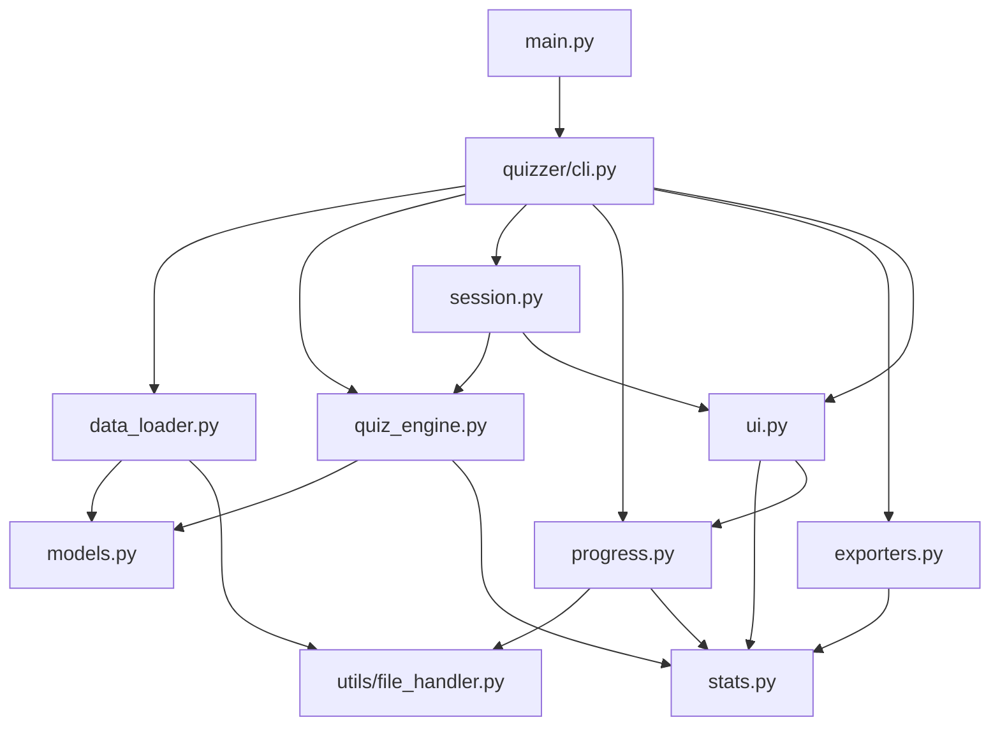
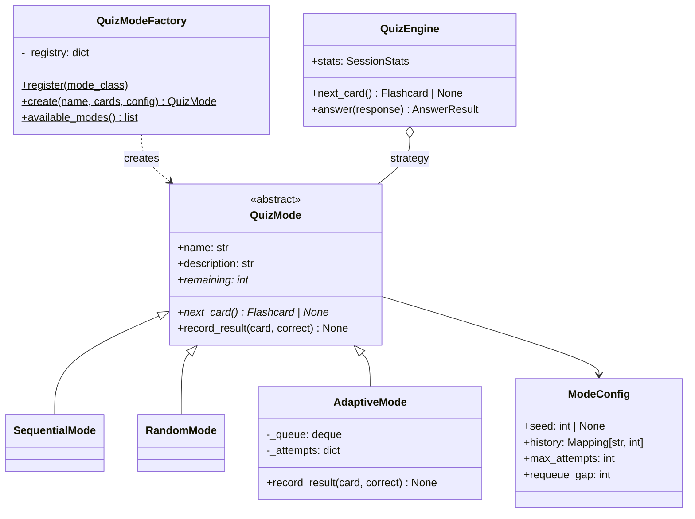
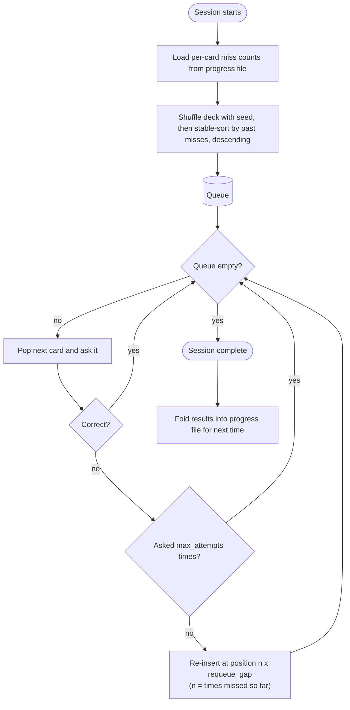
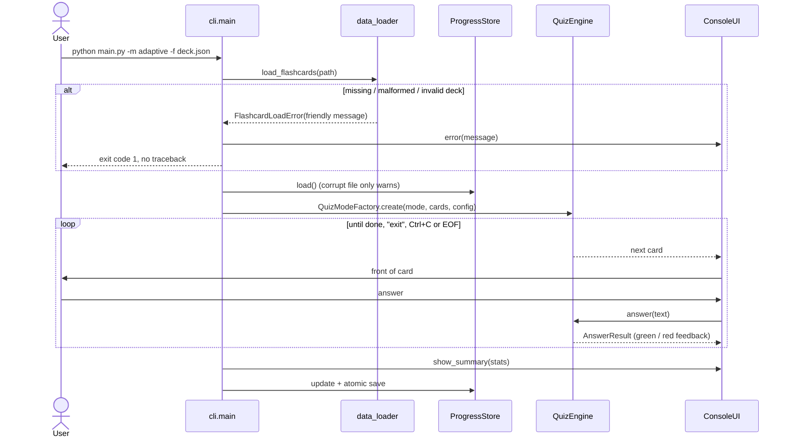

# Architecture

## Module dependencies

Arrows point from a module to what it depends on. Nothing below `cli` imports the
UI, so the engine, loader, stats and progress modules are all testable without a
terminal.

## Strategy and Factory: quiz modes

`QuizEngine` (the Strategy context) only calls `next_card`, `remaining` and
`record_result`. It never checks which mode it has. The CLI never instantiates a mode
directly: it passes the `--mode` string to `QuizModeFactory.create`, and argparse's
`choices` come from `QuizModeFactory.available_modes()`, so registering a new mode
also makes it appear in `--help` automatically.

## Adaptive mode algorithm

The growing gap (`n x requeue_gap`) was introduced after manual testing showed that a
fixed gap let three missed cards cycle between each other and starve the rest of the
deck. See entry 2 in `ai_edit_log.md`.

## Session flow and error handling

Every expected failure is converted to a domain exception carrying a user-facing
message (`FileReadError`, `FlashcardLoadError`, `ExportError`). As a last resort,
`cli.main` catches anything unexpected and prints a one-line message instead of a
traceback, unless `--debug` is passed.
